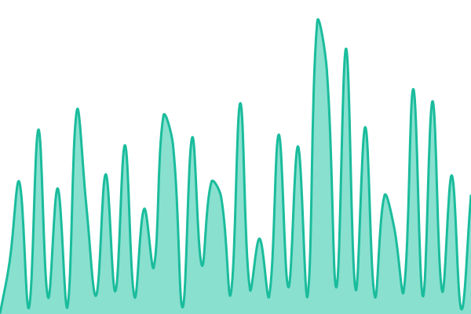
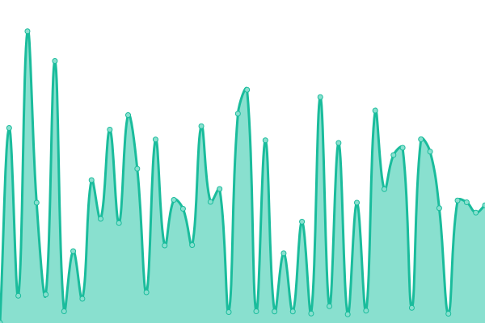
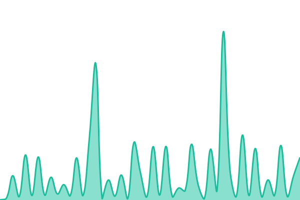
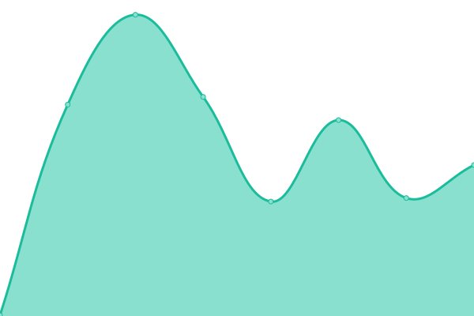

# [📈 Live Status](https://demo.upptime.js.org): <!--live status--> **🟩 All systems operational**

This repository contains the open-source uptime monitor and status page for [Upptime](https://upptime.js.org), powered by [Upptime](https://github.com/upptime/upptime).

With [Upptime](https://upptime.js.org), you can get your own unlimited and free uptime monitor and status page, powered entirely by a GitHub repository. We use [Issues](https://github.com/upptime/upptime/issues) as incident reports, [Actions](https://github.com/amarnaud2/upptime/actions) as uptime monitors, and [Pages](https://demo.upptime.js.org) for the status page.

<!--start: status pages-->
<!-- This summary is generated by Upptime (https://github.com/upptime/upptime) -->
<!-- Do not edit this manually, your changes will be overwritten -->
<!-- prettier-ignore -->
| URL | Status | History | Response Time | Uptime |
| --- | ------ | ------- | ------------- | ------ |
|  [Digital-Advantage.com](https://www.digital-advantage.com) | 🟩 Up | [digital-advantage-com.yml](https://github.com/amarnaud2/upptime/commits/HEAD/history/digital-advantage-com.yml) | 

 167ms
     
 | 

<a href="https://amarnaud2.github.io/upptime/history/digital-advantage-com">100.00%</a>
    

|  [Restonosolo.fr](https://www.restonosolo.fr) | 🟩 Up | [restonosolo-fr.yml](https://github.com/amarnaud2/upptime/commits/HEAD/history/restonosolo-fr.yml) | 

 467ms
     
 | 

<a href="https://amarnaud2.github.io/upptime/history/restonosolo-fr">93.91%</a>
    

|  [Restonosolo.fr/en](https://www.restonosolo.fr/en) | 🟩 Up | [restonosolo-fr-en.yml](https://github.com/amarnaud2/upptime/commits/HEAD/history/restonosolo-fr-en.yml) | 

 323ms
     
 | 

<a href="https://amarnaud2.github.io/upptime/history/restonosolo-fr-en">93.91%</a>
    

|  [LCNM](https://www.lcnm.art) | 🟩 Up | [lcnm.yml](https://github.com/amarnaud2/upptime/commits/HEAD/history/lcnm.yml) | 

 470ms
     
 | 

<a href="https://amarnaud2.github.io/upptime/history/lcnm">93.91%</a>
    

|  [I Love Nice](https://www.ilovenice.eu) | 🟩 Up | [i-love-nice.yml](https://github.com/amarnaud2/upptime/commits/HEAD/history/i-love-nice.yml) | 

 271ms
     
 | 

<a href="https://amarnaud2.github.io/upptime/history/i-love-nice">100.00%</a>
    

<!--end: status pages-->

## 📄 License

- Powered by: [Upptime](https://github.com/upptime/upptime)
- Code: [MIT](./LICENSE) © [Anand Chowdhary](https://anandchowdhary.com), supported by [Pabio](https://pabio.com)
- Data in the `./history` directory: [Open Database License](https://opendatacommons.org/licenses/odbl/1-0/)
